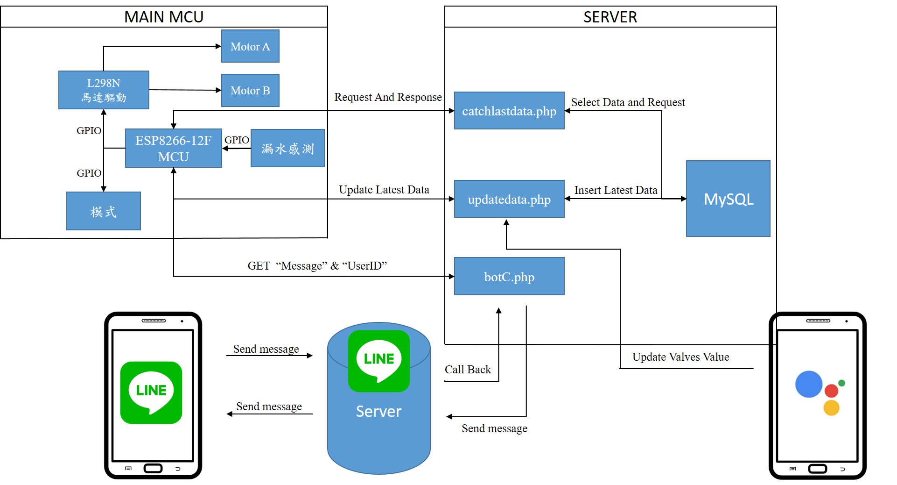

# 發展一套結合Google Assistant 與LineBot裝置進行軌道房機箱滲水偵測通報系統(Development of Near by Rail Cases Detected Leakage SystemCombine LineBot and Google Assistant)

## 功能

透過LINE即時推播可以得知在遠方的裝置與環境狀況
本專題透過漏水感知器可以得知兩種情況"漏水"以及"沒有漏水"
可透過Google Assistant 使用英文語音的方式開關水閥
也可以透過Line向聊天機器人下達指令執行開關水閥的動作
同時也會回應動作已經完成

## 架構圖

